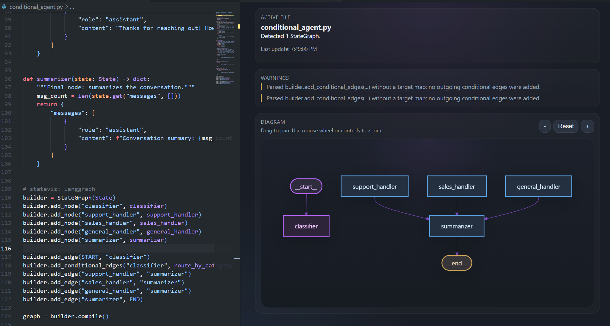
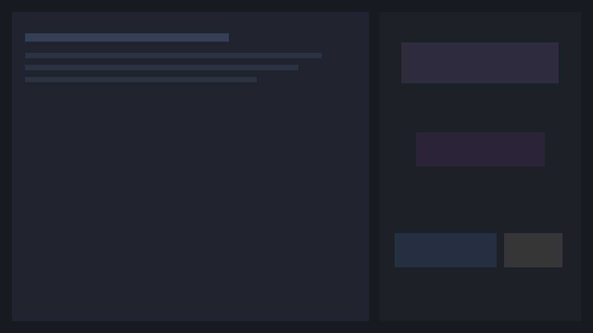
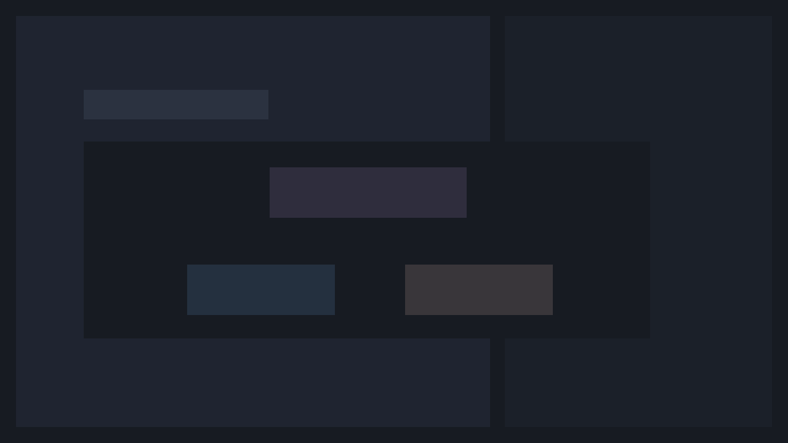

# StateViz

StateViz is a VS Code extension for previewing LangGraph `StateGraph` flows directly beside your Python editor. It watches the active Python file, detects opted-in graphs, and renders an interactive Mermaid-based preview with zoom and pan support.


## Features

- Opens as an editor-side preview, similar to Markdown Preview
- Detects LangGraph Python files automatically, with optional marker overrides
- Supports runtime enrichment through `compiled_graph.get_graph()`
- Parses LangGraph `StateGraph` patterns without executing user code
- Renders interactive Mermaid diagrams with zoom, pan, and reset controls
- Supports multiple graphs in one file with a selector
- Shows useful empty states and warnings for unsupported patterns

## Screenshots

Main preview:



Editor + preview layout placeholder:



Multi-graph selector placeholder:



## Quick Start

1. Open a Python file.
2. Markers are optional. StateViz auto-detects obvious LangGraph files. If you want explicit control, use:

```python
# stateviz: langgraph
```

For runtime enrichment, the preview can auto-detect compiled graphs from ordinary `.compile()` results. You can still pin a specific symbol if needed:

```python
# stateviz: graph=app
```

3. Define a supported LangGraph `StateGraph`.
4. Run `StateViz: Open Preview` from the Command Palette.

Example:

```python
# stateviz: langgraph
from langgraph.graph import StateGraph, START, END

builder = StateGraph(dict)
builder.add_node("draft", lambda state: state)
builder.add_node("review", lambda state: state)
builder.add_edge(START, "draft")
builder.add_edge("draft", "review")
builder.add_edge("review", END)
app = builder.compile()
```

## How It Works

StateViz uses static parsing. It does not import or run your Python file.

Currently supported:

- `StateGraph(...)`
- `add_node(...)`
- `add_edge(...)`
- `set_entry_point(...)`
- `set_finish_point(...)`
- `add_conditional_edges(...)` when targets are statically recognizable

Runtime enrichment:

- Open a LangGraph Python file
- Open the preview
- Click `Use graph.get_graph()`
- If the file contains multiple compiled graphs, use the dropdown to switch between them
- Optional: add `# stateviz: graph=<compiled_symbol>` to force a specific runtime graph symbol

## Commands

- `StateViz: Open Preview`
- `StateViz: Refresh Graph`

## Settings

`stateviz.marker`

- Default: `# stateviz: langgraph`
- Optional explicit opt-in marker; automatic LangGraph detection still works without it

## Development

```bash
npm install
npm run build
npm test
```

Launch the extension in VS Code with `F5`, then run `StateViz: Open Preview` in the Extension Development Host.

## Packaging

Build a VSIX locally:

```bash
npm run package
```

This creates a `.vsix` file in the project root. Before publishing to the Marketplace, update `publisher`, `repository`, `homepage`, and `bugs` in `package.json` to real values.
